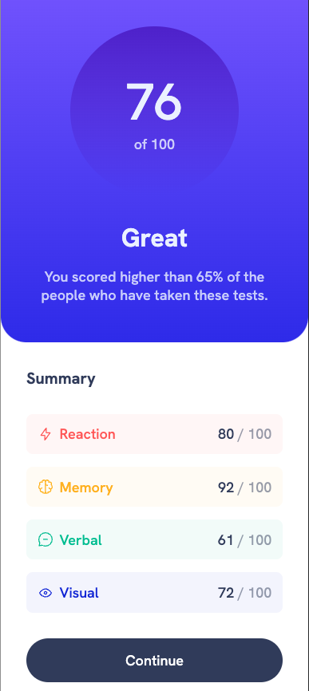

# Frontend Mentor - Results summary component solution

This is a solution to the [Results summary component challenge on Frontend Mentor](https://www.frontendmentor.io/challenges/results-summary-component-CE_K6s0maV). Frontend Mentor challenges help you improve your coding skills by building realistic projects.

## Table of contents

- [Overview](#overview)
  - [Screenshot](#screenshot)
  - [Links](#links)
- [My process](#my-process)
  - [Built with](#built-with)
  - [What I learned](#what-i-learned)
- [Author](#author)

## Overview

### Screenshot

### Links

- Solution URL: [Here]https://github.com/milutindzunic-localsearch/frontendmentor-results-summary-component)
- Live Site URL: [Here](https://milutindzunic-localsearch.github.io) - not guaranteed to be up at the moment you're reading this :)

## My process

### Built with

- HTML5 (hopefully somewhat semantic) markup
- CSS custom properties
- Flexbox & CSS Grid

### What I learned

This is my second Frontend Master challenge solution - this challenge was similar, but quite a bit more... challenging than the first introductory qr code challenge.

I tried to do something similar to what Kevin Powell did in his video (after watching it a couple of days prior to attempting the solution) - using custom CSS properties, BEM class naming, etc...

Generally, I found it a bit difficult to exactly match my styles to the design (as I am not a pro user). Lots of times I went with the 'best effort', and in the end I'm sort of happy with how it turned out.
